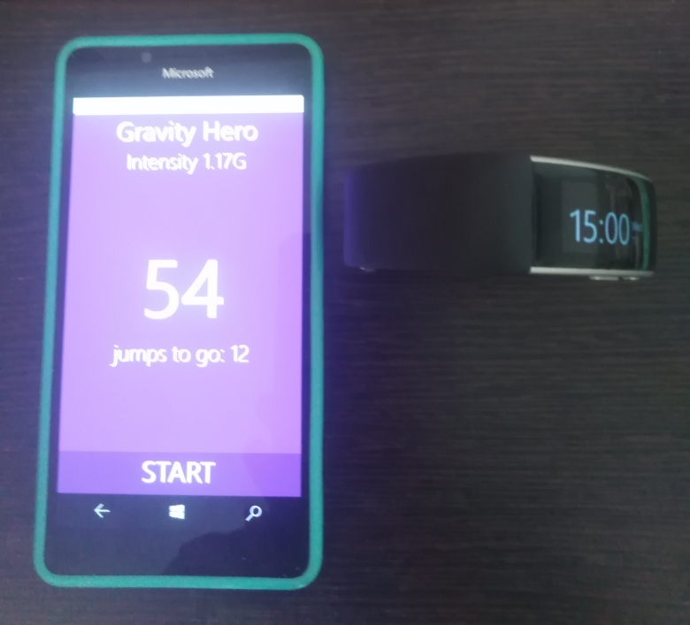

# BandGravityHero
My fast and simplest Microsoft's GravityHeroUWP "fork" :)

## Screenshots
<table><tr>
<td>  </td>
</tr></table>

## My 2 cents
- Microsoft.Band lib upgraded.
- Main W10M os build switched from 10570 to 19041. 

## Tech
- UWP, ARM
- Min. W10M os build: 10240 (Hello, Project Astoria)
- Microsoft Band 2 compatible (yes, Band device needed to jump control)

## Credits / License
- Kevin Ashley, Microsoft
- MIT

## ..
As is. No support. RnD only / DIY

## .
[m][e] 2023

 